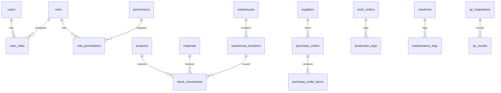
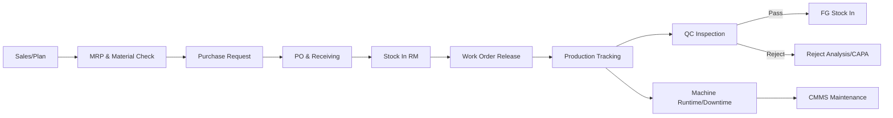

# ERP Manufacturing Foundation Blueprint

## 1) Struktur Folder Enterprise-Grade

```txt
src/
├── app/
│   ├── (auth)/login/page.tsx
│   ├── (erp)/dashboard/page.tsx
│   ├── (erp)/inventory/products/page.tsx
│   ├── api/health/route.ts
│   ├── error.tsx
│   ├── loading.tsx
│   └── layout.tsx
├── modules/
│   ├── inventory/
│   │   ├── components/
│   │   ├── hooks/
│   │   ├── services/
│   │   ├── repositories/
│   │   ├── actions/
│   │   ├── validations/
│   │   ├── types/
│   │   ├── pages/
│   │   └── schemas/
│   ├── purchasing/...
│   ├── production/...
│   ├── maintenance/...
│   ├── qc/...
│   └── finance/...
├── components/
│   └── ui/
├── services/
├── repositories/
├── hooks/
├── lib/
├── actions/
├── types/
├── validations/
├── constants/
├── providers/
├── config/
├── styles/
└── utils/
```

## 2) Arsitektur (Clean + Modular Feature)

Layer per module:
1. `pages/components`: UI & orchestration.
2. `actions`: Next.js Server Actions (use-case entrypoint).
3. `services`: business logic, workflow, policy check.
4. `repositories`: persistence abstractions ke Supabase/PostgreSQL.
5. `schemas/validations/types`: kontrak input-output ketat.

Cross-cutting:
- `lib/auth` session resolver server-side.
- `config/rbac.ts` role-permission matrix.
- `providers` untuk theme/query/realtime.
- `utils/audit.ts` untuk audit trail standar.

## 3) Database Schema SQL Lengkap

Lihat file: `supabase/migrations/202605170001_erp_foundation.sql`.

## 4) Supabase Setup

1. Buat project Supabase dan aktifkan Auth (email/password + SSO opsional).
2. Jalankan migration SQL.
3. Generate type:
   ```bash
   supabase gen types typescript --project-id <project-id> > src/types/database.ts
   ```
4. Simpan env:
   - `NEXT_PUBLIC_SUPABASE_URL`
   - `NEXT_PUBLIC_SUPABASE_ANON_KEY`
   - `SUPABASE_SERVICE_ROLE_KEY`
5. Aktifkan Realtime untuk tabel operasional (`stock_movements`, `production_logs`, `maintenance_logs`, `audit_logs`).

## 5) Next.js Setup

- App Router + Server Components default.
- `middleware.ts` untuk route protection + tenant/role guard.
- Gunakan `loading.tsx`, `error.tsx`, dan `Suspense` di halaman berat.
- Server Actions hanya untuk mutasi data.

## 6) Contoh Code Penting

Lihat:
- `src/lib/auth.ts`
- `src/config/rbac.ts`
- `src/modules/inventory/services/inventory.service.ts`
- `src/modules/inventory/actions/inventory.actions.ts`

## 7) Authentication Flow

1. User login via Supabase Auth.
2. Session cookie tervalidasi di middleware.
3. Middleware attach context (user_id, tenant_id, roles).
4. Server Action cek session + role permission sebelum mutasi.
5. Semua mutasi menulis `audit_logs`.

## 8) RBAC Flow

- Role hierarki: `super_admin`, `owner`, `manager`, `purchasing`, `warehouse`, `production`, `qc`, `maintenance`.
- Permission atomik: `create`, `read`, `update`, `delete`, `approve`, `export`.
- Policy enforcement:
  - UI visibility (menu/button guard)
  - Server action guard (hard enforcement)
  - RLS guard (database enforcement)

## 9) Inventory Module Implementation

Core use case:
- Product Management.
- Stock In / Stock Out.
- Stock Adjustment.
- Warehouse Transfer.
- Batch tracking.
- Low stock alert query (`available_qty <= reorder_point`).

Pattern:
- Input divalidasi Zod.
- Service hitung stock delta + consistency check.
- Repository simpan `stock_movements` immutable ledger.
- Materialized view / query untuk current balance per location + batch.

## 10) Dashboard Implementation

Widget utama:
- KPI produksi (output, reject rate, OEE-lite).
- Stock summary.
- Low stock alert.
- Machine downtime.
- Purchase status.
- Realtime activity stream dari `audit_logs`.

## 11) Reusable Component Strategy

Komponen wajib:
- `DataTable` (TanStack, server pagination, sort/filter).
- `AppForm` (RHF + Zod resolver).
- `Modal`, `Drawer`, `ConfirmDialog`.
- `StatusBadge`, `KpiCard`, `SearchFilter`, `EmptyState`, `LoadingState`.

Aturan:
- Pure UI di `components/ui`.
- Domain-specific wrapper di `modules/<name>/components`.

## 12) ERD



## 13) Flowchart Manufacturing



## 14) Best Practices

- Wajib strict TypeScript + lint gate di CI.
- Selalu gunakan repository + service, hindari query langsung dari UI.
- Gunakan idempotency key untuk transaksi kritis.
- Ledger transaksi immutable, hindari update historis.

## 15) Scalability Strategy

- Multi-tenant strategy: `tenant_id` pada seluruh tabel transaksional.
- Read pattern: index komposit + partial index + pagination cursor.
- Write pattern: append-only ledger + async projection.
- Realtime: channel tersegmentasi per tenant/module.

## 16) Security Strategy

- RLS strict default deny.
- Service role hanya backend trusted path.
- Enkripsi data sensitif, secret via env vault.
- Audit trail wajib untuk create/update/delete/approve/export.

## 17) Deployment Strategy

- Environments: dev/staging/prod.
- CI/CD: lint, typecheck, unit test, migration diff, preview deploy.
- Blue/green deployment untuk rilis major.
- Observability: tracing + metrics + error reporting.

## 18) Development Roadmap

- Q1: Auth, RBAC, master data, inventory.
- Q2: Purchasing end-to-end + receiving.
- Q3: Production, BOM, WO, tracking.
- Q4: CMMS + QC + finance basic.
- Continuous: performance tuning, load test, security hardening.
